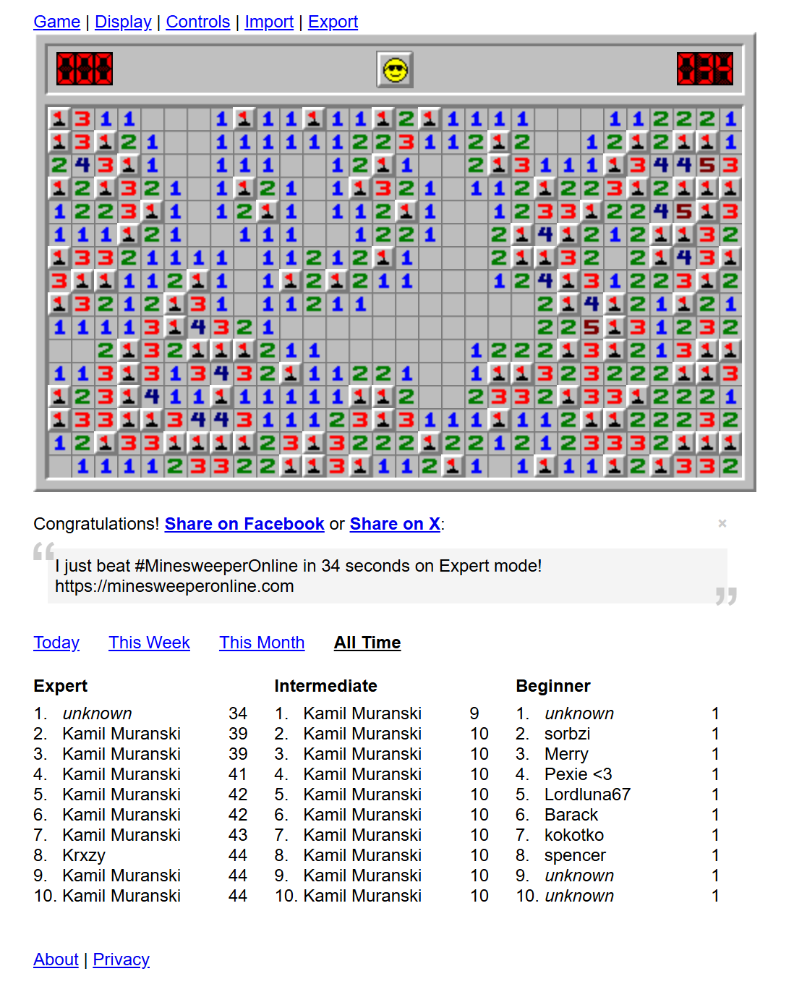

# Jev Minesweeper

Plays Minesweeper on https://minesweeperonline.com/ automatically. Selenium reads the board
from the page, and the [Jev model](https://docs.typesafe.ai/) judges which hidden cells are
safe and which are mines.



## Setup

```bash
uv sync
```

Create a `.env` file with your API key (from https://console.typesafe.ai/keys):

```
TYPESAFE_API_KEY=your-key
```

Microsoft Edge must be installed; the matching EdgeDriver is downloaded automatically.

Run the commands with `uv run` so that the locked project dependencies are used. The
program also needs network access to the game site, the EdgeDriver download source, and
the Jev API.

## Usage

```bash
uv run python web_mine.py      # intermediate (default)
uv run python web_mine.py 1    # beginner 9x9, 10 mines
uv run python web_mine.py 2    # intermediate 16x16, 40 mines
uv run python web_mine.py 3    # expert 16x30, 99 mines
```

The browser window stays open after the game ends.

If the page cannot be loaded, the difficulty cannot be selected, the board cannot be read,
or a cell cannot be clicked, the run stops with an error instead of continuing with stale
state. If the maximum number of rounds is reached, the final status is
`max_steps_reached`.

## How it works

Each round:

1. Read every visible cell from the page DOM.
2. Turn each number into a fact: "these hidden cells hold exactly N mines". Code also derives
   subset-difference, partial-overlap, and (in the endgame) remaining-mine-count facts.
3. Send each fact to Jev as a Choice question: `all_safe`, `all_mines`, or `undetermined`.
4. Click every cell Jev judges safe and flag every cell it judges a mine (threshold 0.9).
5. If nothing is certain, guess the cell with the lowest estimated mine density.

Every question and answer is printed to the console.

## Troubleshooting

- `TYPESAFE_API_KEY is not set`: create `.env` in the project directory and add the key.
- Browser startup fails: check that Microsoft Edge is installed and that the machine can
   download the matching EdgeDriver.
- Use `uv run python web_mine.py --help` to verify the project environment without opening
   a browser or calling the game.
